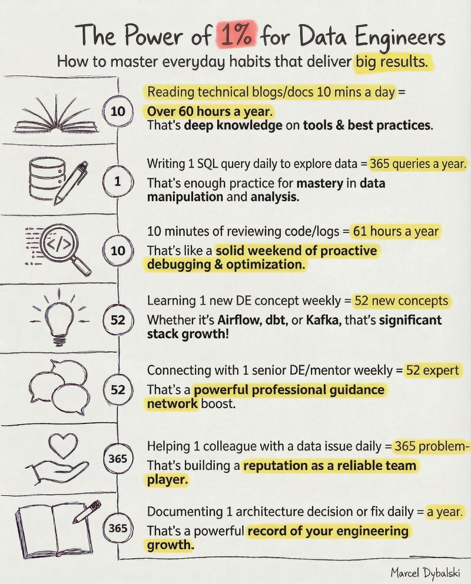

## Better Habits, Better Results

Here's what separates top-tier engineers from average ones. It's not genius... it's discipline.

Small actions compound into extraordinary results:

- **10 mins reading technical docs daily = 60+ hours yearly**
  ↳ Deep knowledge on tools & best practices

- **1 SQL query daily to explore data = 365 queries yearly**
  ↳ That's mastery in data manipulation and analysis

- **10 mins reviewing code/logs = 61 hours yearly**
  ↳ A solid weekend of proactive debugging & optimization

- **Learning 1 DE concept weekly = 52 new concepts**
  ↳ Whether it's Airflow, dbt, or Kafka, significant stack growth

- **Connecting with 1 senior DE weekly = 52 expert conversations**
  ↳ Powerful professional guidance network

- **Helping 1 colleague daily = 365 problems solved**
  ↳ Building a reputation as a reliable team player

- **Documenting 1 decision daily = A year of engineering clarity**
  ↳ A powerful record of your growth

---

The shift isn't about working harder. It's about building systems that make excellence automatic.

*You don't rise to the level of your goals. You fall to the level of your habits.*

**What's one 1% habit you could start this week?**

