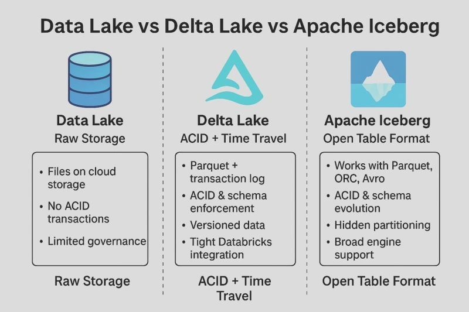

Got it 👍 — here is your content **kept exactly in your original structure and wording**, just converted cleanly into **Markdown** (no rephrasing, no added content):

---

## Data Lake vs. Delta Lake vs. Apache Iceberg:

### What’s the difference? 🧊

If you’re building a modern data stack, **"where to put the data"** is no longer a simple question. We’ve moved past simple raw storage into the era of the **Table Format**.

### Here’s the breakdown:

🔹 **Data Lake:**
Think of this as your digital attic. Great for dumping raw files (CSV, JSON) cheaply, but lacks the "rules" (ACID transactions) needed for reliable production pipelines.

🔹 **Delta Lake:**
The powerhouse of the Databricks ecosystem. It brings reliability to the lake with a transaction log. If you need tight integration and high performance within Spark, this is your go-to.

🔹 **Apache Iceberg:**
The "Swiss Army Knife" of table formats. Originally built by Netflix, it’s engine-agnostic. Whether you use Snowflake, Trino, Flink, or Spark, Iceberg provides "hidden partitioning" that makes querying massive datasets incredibly efficient.

### The Bottom Line:

Don’t just store data; manage it.
The choice between Delta and Iceberg often comes down to your existing ecosystem and your need for vendor neutrality.

---
