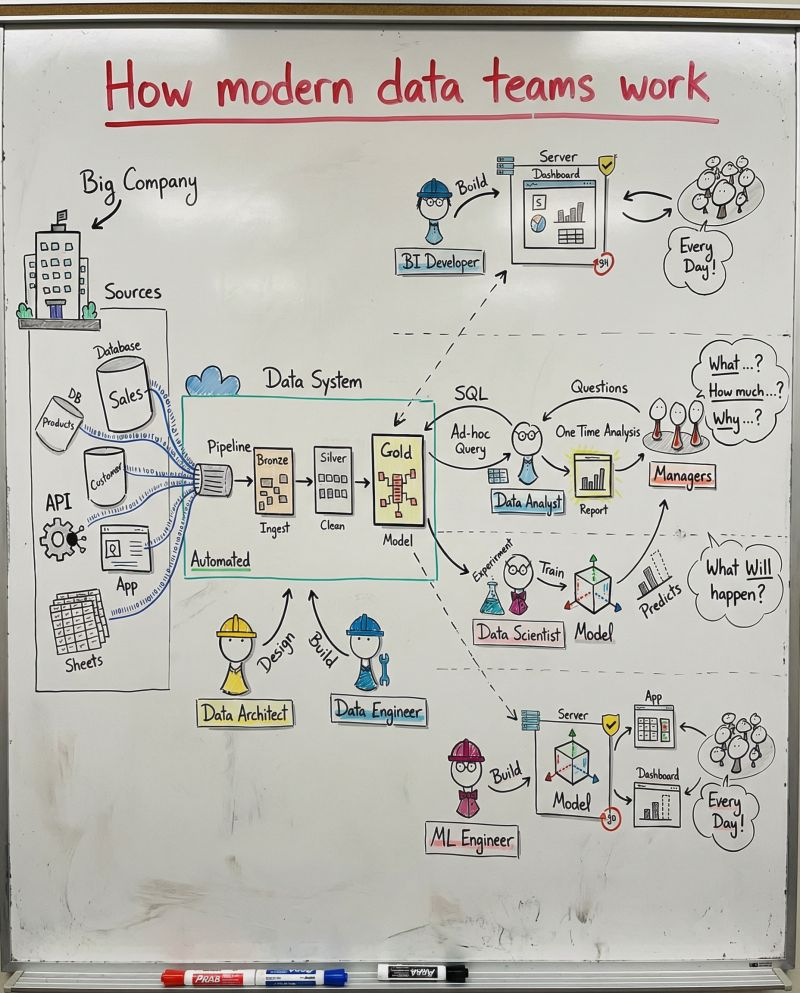

Your data org isn't broken.

It's just built like random houses with no roads.

Here's the difference:

Average teams: Everyone builds in silos.

Modern teams: Everyone builds in sync.

Think of it like a city.
Without a plan? Chaos.
With one? Infrastructure that scales.

Here's the blueprint:

Data Architect: The City Planner
→ Designs where data lives and how it flows.
→ Sets the standards before anyone builds.

Data Engineer: The Infrastructure Builder
→ Turns messy inputs into trusted assets.
→ Makes data move reliably at scale.

Analytics Engineer: The Bridge Builder
→ Transforms raw data into business-ready models.
→ One source of truth for all consumers.

BI Developer: The Dashboard Architect
→ Makes insights accessible to everyone.
→ Connects metrics to business KPIs.

Data Analyst: The Business Translator
→ Leadership knows what's happening and why.
→ Defines KPIs with stakeholders.

Data Scientist: The Future Predictor
→ Builds models that move from reactive to proactive.
→ Forecasts with confidence.

Data Steward: The Quality Guardian
→ Ensures trust and compliance.
→ Data you can actually rely on.

The loop that powers it all:
Goal set → Architect designs → Engineers build → Analysts measure → Scientists predict → Insights feed back → Repeat.

The result?
✅ One source of truth
✅ Faster decisions
✅ Clear accountability
✅ Real business impact

Modern data teams don't work in silos.
They work in sync.

---
